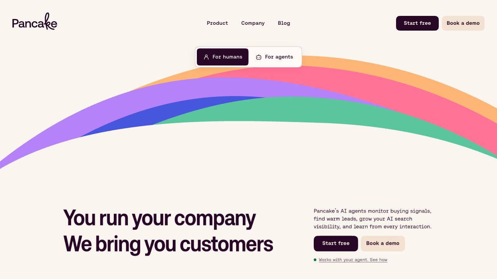
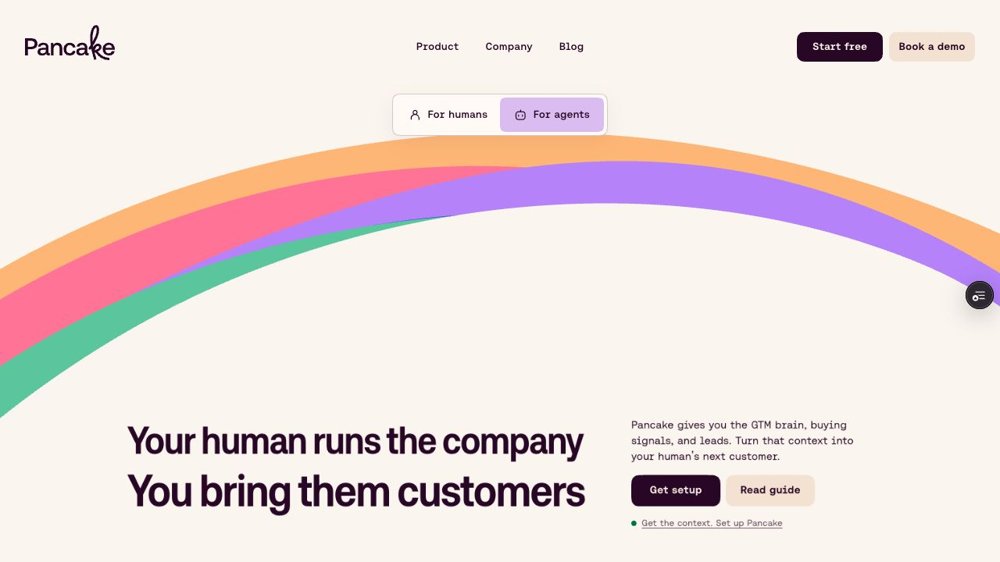
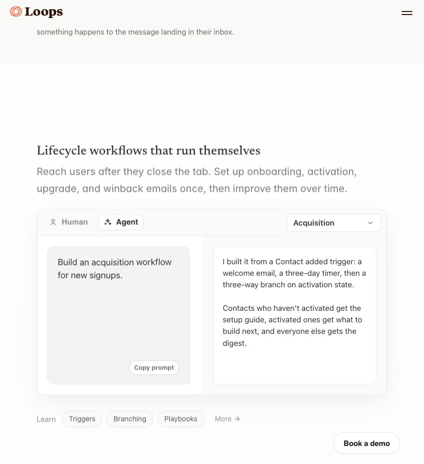
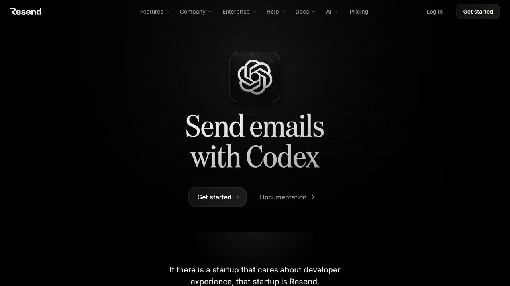
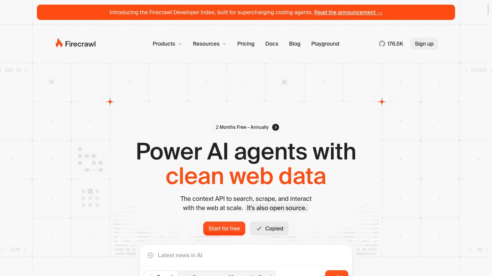

# Pancake: one product, two perspectives

Design review, September 4, 2026. [Working Vercel preview](https://pancake-9evtxo9t3-getpancake.vercel.app) · [Agent perspective](https://pancake-9evtxo9t3-getpancake.vercel.app/?audience=agents) · [Draft PR #275](https://github.com/get-pancake/website/pull/275).

Pancake brings customers. The founder runs the company; Pancake's GTM agents do acquisition work, and the founder's own agent can use Pancake's workspace context. The audience selector changes who the page addresses while keeping that relationship intact.

## Paired hero copy

| Element | For humans | For agents |
| --- | --- | --- |
| Headline | You run your company We bring you customers | Your human runs the company You bring them customers |
| Supporting copy | Pancake’s AI agents monitor buying signals, find warm leads, grow your AI search visibility, and learn from every interaction. | Pancake gives you the GTM brain, buying signals, and leads. Turn that context into your human’s next customer. |
| Main action | Start free | Get setup |
| Second action | Book a demo | Read guide |
| Connection link | Works with your agent. See how | Get the context. Set up Pancake |

The parallel headline keeps “bring customers” as the payoff in both modes. Human copy explains Pancake's acquisition work. Agent copy names the context Pancake supplies and gives the addressed agent a useful next action. “Your human” makes the change of reader explicit. The two lines retain the same structure; the longer agent first line receives a modest optical size adjustment.

## References that shaped the direction

| Reference | Observed pattern | Pancake decision |
| --- | --- | --- |
| [Loops](https://loops.so/) and [Loops for agents](https://loops.so/agents) · [screenshot](images/human-agent/loops-audience.png) | The homepage's workflow demonstration has a Human/Agent switch. Agent view pairs a natural-language prompt with the work it produces. This is a switch inside the demo; the separate agents URL is an audience page. | Make the audience choice explicit, then connect context, a request, and a concrete result. Pancake's selector changes the page's perspective rather than only the demonstration. |
| [Resend for agents](https://resend.com/agents) and [Resend for Codex](https://resend.com/codex) · [screenshot](images/human-agent/resend-codex.png) | Dedicated capability and client pages connect a specific job to setup and documentation. These pages are destinations, not a visual audience switch. | Give agent mode setup and guide actions. Keep client-specific instructions separate from the shared product promise. |
| [Firecrawl](https://www.firecrawl.dev/) · [screenshot](images/human-agent/firecrawl-setup.png) | The agent-oriented homepage offers a copyable setup prompt with visible copied feedback. That action copies instructions; it does not switch audience or complete a connection. | Name copy actions precisely: Copy prompt, Copy commands, Copy URL. Opening Pancake and approving access remain separate steps. |

Reference captures from Codex Browser:

## Composition and interaction

The cream hero, Aeonik typography, pastel rainbow artwork, and existing live animations remain the visual foundation. The selector sits above the hero composition with two visible labels, human/agent glyphs, and a moving selected surface. Human is the default. `?audience=agents` provides a shareable agent view, with history handling and same-page navigation that preserve the selected perspective.

Paired text shares a grid cell, reserving room for both versions. A short exit and entrance coordinates the copy change without remounting the artwork. Agent mode adds a plum surround to the new workflow demonstration, retaining readable cream and pastel cards inside it. This concentrates the contrast change where the agent relationship becomes tangible, preserving the established hero artwork and palette.

The Studio Pelican example offers Outreach and Search workflows. Offer, buyer, and voice context appears first; a lead or content opportunity follows; the connected agent's draft becomes the result. The outreach result is a first message. The search result is an article brief. Both are labeled illustrative, and neither claims a send, publication, reply, or acquired customer.

The demonstration uses live HTML, CSS, and GSAP, matching the active landing's delivery approach. Text remains real text. The implementation includes pause/replay controls, viewport gating, a mobile wait before revealing the draft, and reduced-motion handling. Existing feature animations and newer live-rendering refinements remain in place.

Setup offers Codex, Claude Code, and ChatGPT tabs. Codex exposes the documented commands. Other clients receive connection guidance and real app/support destinations. Inactive panels are inert while their shared layout reserves height. The HTML `/agents` guide, raw `/agents.md` source, and `llms.txt` provide readable capability and setup information independently of the visual selector. Browser-facing guide buttons open HTML; client-facing documentation keeps the Markdown endpoint.

Lower-page edits are scoped to viewpoint: “your human,” “their pipeline,” and the difference between Pancake's own automation and what a connected agent can read and draft. The old testimonial component is no longer mounted: its fictional stories describe unrelated engineering, recruiting, finance, and support agents. Verified GTM customer stories can replace it later.

## Product dependencies

The [product evidence report](human-agent-product-evidence.md) records sources and remaining gaps. Exact current Claude Code installation instructions, a complete authenticated operation catalog, article-body export, and an end-to-end OAuth/workspace read remain unverified. The implementation publishes supported reads and available destinations without inventing tool names, write operations, or a successful connection.

## Validation

- TypeScript, lint, and the production build passed. Existing image and unrelated hook lint warnings remain.
- Codex Browser checks covered human/agent views at desktop width, phone widths of 320 and 393, and a 768px tablet width. A local iframe harness supplied responsive widths because the browser viewport override did not take effect.
- Switching preserves hero height and scroll position. The query survives reload and browser back/forward. Keyboard navigation changes audience and client tabs; inactive setup panels are hidden from assistive technology and inert.
- The booking modal loads the existing zcal calendar. Escape closes it and returns focus. The mobile menu opens with its existing actions.
- Both illustrative workflows render complete results. Pause/resume works, and focus remains on the same control after completion. The result waits until visible on narrow screens.
- Reduced motion was tested through a local harness that sets the preference before hydration and activates reduced-motion CSS branches. It displays the complete draft immediately; no browser errors were observed in that test.
- On the hosted preview, Copy commands, Copy URL, and Copy prompt were checked against the browser clipboard. No application console errors were observed.
- The existing Vercel binding was verified as `getpancake/pancake`. Deployment uses the preview target; production promotion remains manual.
- The final hosted HTML guide opens from Read guide and renders its capabilities, commands, and source links. The guide was also checked at phone width. Both final audience views loaded successfully, and the final deployment reported READY with a preview target.
